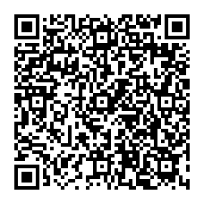

# Well, who am I
I'm a 15 year old Norwegian computer nerd who enjoys tinkering with code and software. I also like playing games. I sound really generic, don't I? Maybe cause I am.

Here's a summary of my personality, in audio format:

<audio controls>
    <source src="../music/AAAAAAAAAAAAAAAAAAAAAAAAAAAAAAAAAAA.mp3" type="audio/mp3">
    Seems like playing audio isn't supported in your browser.
</audio>

## What I've done and made
I've:
- been in 3 organizations dabbling with computers. (Terrific Tea Studios, Neutron Technologies, Project Segfault)
- made a tool called Fixdows (now private)
- lived for 14 years (amazing accomplishment)
- Probably some more things I forgot.
## What do I like to do
I like to:
- Listen to music ([last.fm](https://www.last.fm/user/Odyssey346))
- Play games in VR
- Oh, and also play games. I like TF2
- Sit in bed for a while whenever I get the opportunity to
- Waste my money on stinkbuds (haha funny DankPods reference)

## Skills That *Might* Pay The Bills

## Money
If you would like to give me money, thank you! I accept monero.

If you can't scan the QR, here's my address instead: ``45wYu3oEAhu7s9aodftL2iBztYCdKzTZ4gaTRXGRRsN8cfVbdDMrVCEDmUczBiosE3ESVtyRKodXKgcTThyNsF2XGJvee5V``

OpenAlias is also set up on <a href="https://odyssey346.dev">odyssey346.dev</a>, so you can just put odyssey346.dev in a client that supports OpenAlias, for example MyMonero.

I accept Monero because it's stable enough and it's 100% anonymous. I don't want to know who donates to me, I like mysteries.
